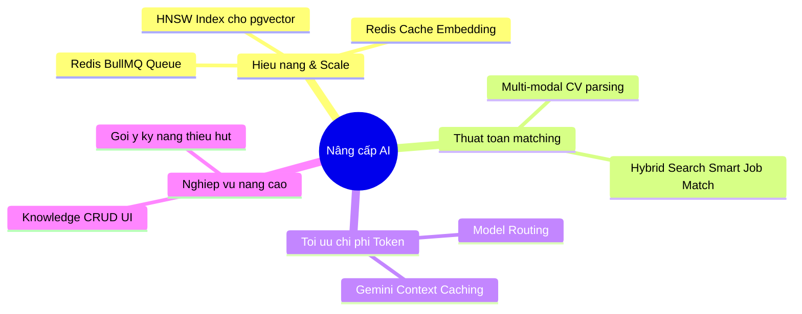

# Lộ Trình Nâng Cấp Hệ Thống AI & Đồ Án Kỹ Thuật (Future Upgrades Roadmap)

Tài liệu này vạch ra các định hướng kỹ thuật và giải pháp nâng cấp hệ thống AI Matching khi dự án chuẩn bị mở rộng quy mô (scale-up), tối ưu chi phí vận hành thực tế và tăng cường độ chính xác nghiệp vụ. Đây là tài liệu định hướng dành riêng cho đội ngũ **Kỹ sư Phần mềm (SE)**.

---

## 📌 Tổng Quan Lộ Trình Nâng Cấp



---

## I. Tối Ưu Hóa Hiệu Năng & Khả Năng Mở Rộng (Performance & Scalability)

Khi cơ sở dữ liệu đạt tới quy mô lớn (ví dụ: >10,000 Jobs và >50,000 CVs), việc truy vấn Vector tuần tự (Sequential Scan) tính toán khoảng cách Cosine trên toàn bộ bảng sẽ gặp hiện tượng nghẽn cổ chai (bottleneck).

### 1. Cấu hình Index HNSW (Hierarchical Navigable Small World) cho `pgvector`

- **Vấn đề:** Mặc định việc truy vấn tìm kiếm vector không sử dụng index sẽ quét qua mọi bản ghi, gây trễ truy vấn (latency cao).
- **Giải pháp:** Tạo chỉ mục HNSW sử dụng hàm cosine distance (`vector_cosine_ops`) để chuyển truy vấn từ tìm kiếm chính xác tuyệt đối sang tìm kiếm xấp xỉ gần đúng (ANN) với độ chính xác >98% nhưng tốc độ nhanh hơn gấp 100 lần.
- **Cách thức triển khai (SQL Script dành cho SE):**

  ```sql
  -- Tạo index HNSW cho bảng Job
  CREATE INDEX IF NOT EXISTS "Job_embedding_hnsw_idx"
  ON "Job"
  USING hnsw (embedding vector_cosine_ops)
  WITH (m = 16, ef_construction = 64);

  -- Tạo index HNSW cho bảng CV
  CREATE INDEX IF NOT EXISTS "CV_embedding_hnsw_idx"
  ON "CV"
  USING hnsw (embedding vector_cosine_ops)
  WITH (m = 16, ef_construction = 64);
  ```

  _(Lưu ý: Chỉ số `m` và `ef_construction` có thể điều chỉnh dựa trên phân bố tài nguyên RAM/CPU của server database)._

### 2. Thiết lập Queue System (Hàng đợi xử lý nền) cho Tác Vụ AI

- **Vấn đề:** Hiện tại, luồng chạy nền khi ứng viên yêu cầu quét việc hoặc ứng tuyển đang dùng cơ chế `processInBackground` dạng _fire-and-forget_ (chạy bất đồng bộ trực tiếp của NestJS). Nếu server bị crash giữa chừng, tác vụ sẽ bị mất. Ngoài ra, việc gọi API LLM/Gemini hàng loạt không kiểm soát dễ chạm giới hạn tần suất gọi (Rate Limits - 429 Too Many Requests).
- **Giải pháp:** Tích hợp hệ thống hàng đợi Redis (ví dụ: **BullMQ** hoặc **NestJS Queue**) để:
  - Xếp hàng các yêu cầu sinh vector nhúng và phân tích LLM.
  - Tự động thử lại (retry) khi gặp lỗi mạng hoặc lỗi quá tải API.
  - Giới hạn tần suất gọi API (Rate Limiting) ở mức an toàn (ví dụ: tối đa 10 tác vụ/phút đối với Gemini Free tier).

---

## II. Nâng Cấp Thuật Toán Tìm Kiếm & Gợi Ý (Algorithm Enhancements)

### 1. Hybrid Search cho Smart Job Match (Lọc thô)

- **Vấn đề:** Hiện tại, luồng quét tìm việc nhanh chỉ sử dụng duy nhất Vector Search (Dense Retrieval) để lấy Top 10. Đôi khi tìm kiếm ngữ nghĩa có thể bỏ sót các từ khóa công nghệ viết tắt cực kỳ đặc thù hoặc yêu cầu viết chính xác (ví dụ: `Cobol`, `SAP`).
- **Giải pháp:** Áp dụng thuật toán Hybrid Search kết hợp **Vector Search** (Dense) và **Full-Text Search** (Sparse/Postgres FTS) thông qua cơ chế trộn điểm **RRF (Reciprocal Rank Fusion)** (tương tự thuật toán đang dùng trong RAG Retriever hiện tại).
- **Lợi ích:** Đảm bảo vừa hiểu ngữ cảnh của CV/JD, vừa không bao giờ bỏ sót các từ khóa công nghệ đặc thù bắt buộc phải có.

### 2. Xử lý CV dạng hình ảnh (Multi-modal CV Parsing)

- **Vấn đề:** Nhiều ứng viên tải CV dạng ảnh chụp hoặc file PDF scan dưới dạng ảnh. Bộ trích xuất text thông thường sẽ không đọc được.
- **Giải pháp:** Tận dụng khả năng xử lý đa phương thức (Multi-modal) của Gemini API. SE có thể gửi trực tiếp file ảnh/scan CV vào Gemini để trích xuất cấu trúc dữ liệu JSON, thay vì chỉ đọc file văn bản thuần túy.

---

## III. Tối Ưu Hóa Chi Phí Token & Vận Hành AI (Cost Optimization)

### 1. Tận dụng Gemini Context Caching

- **Cơ chế:** Khi có nhiều ứng viên ứng tuyển vào cùng một công việc (JD), nội dung JD và ngữ cảnh RAG nghiệp vụ (chiếm ~1000 - 1500 tokens) luôn giống nhau trong mỗi lượt gọi LLM.
- **Giải pháp:** Bật tính năng **Context Caching** của Gemini API đối với phần JD và RAG tri thức. Google sẽ lưu trữ cache phần ngữ cảnh này trên máy chủ của họ trong khoảng thời gian nhất định (ví dụ: vài giờ đến vài ngày).
- **Lợi ích:**
  - Giảm thời gian xử lý LLM xuống dưới 50% (giảm Latency).
  - Cắt giảm tới **50% chi phí token Input** của API Gemini.

### 2. Định tuyến Mô hình AI linh hoạt (Model Routing)

- **Giải pháp:** Phân loại độ phức tạp của JD để định tuyến đến model LLM phù hợp:
  - _Đối với các Job đơn giản, ít tiêu chí:_ Sử dụng mô hình siêu rẻ/nhanh như `gemini-1.5-flash` hoặc `gemini-3.1-flash-lite-preview`.
  - _Đối với các Job phức tạp, cấp bậc cao (Tech Lead/Manager) đòi hỏi suy luận logic cao:_ Định tuyến request sang mô hình mạnh hơn như `deepseek-chat` (DeepSeek V3) hoặc `gemini-1.5-pro` để đảm bảo chất lượng đánh giá.

---

## IV. Mở Rộng Tính Năng Nghiệp Vụ AI (Advanced AI Features)

### 1. Giao diện CRUD quản lý RAG Knowledge Base cho Admin/HR

- **Giải pháp:** Xây dựng một màn hình quản trị trên webapp cho phép HR hoặc Quản trị viên hệ thống có thể:
  - Thêm mới các từ viết tắt công nghệ (ví dụ: `Golang` = `Go lang`).
  - Cập nhật các quy tắc nghiệp vụ tuyển dụng mới của công ty.
  - Hệ thống sẽ tự động bắt sự kiện (event hook), sinh Vector nhúng cho quy tắc đó và lưu vào bảng `RagKnowledge` trong cơ sở dữ liệu thời gian thực.

### 2. Đề xuất Lộ trình học tập & Kỹ năng thiếu hụt cho Ứng viên

- **Giải pháp:** Dựa trên kết quả phân tích "Điểm cần cải thiện" (Gaps) từ LLM khi ứng viên xem chi tiết Matching:
  - AI sẽ tự động đối chiếu các kỹ năng thiếu hụt với thư viện khóa học sẵn có trên nền tảng (hoặc các nguồn mở như Coursera, Udemy).
  - Đưa ra đề xuất cá nhân hóa: _"Để tăng cơ hội đỗ vị trí này thêm 20%, bạn nên bổ sung kiến thức về Redis (Xem khóa học gợi ý tại đây)"_.
  - Tăng tính tương tác của ứng viên với nền tảng và tạo thêm nguồn thu (monetization) thông qua tiếp thị liên kết khóa học.

## V. Hướng nâng cấp siêu căng: Agent Based- đọc link repo github đối với ngành IT để đánh giá, đối chiếu với CV
